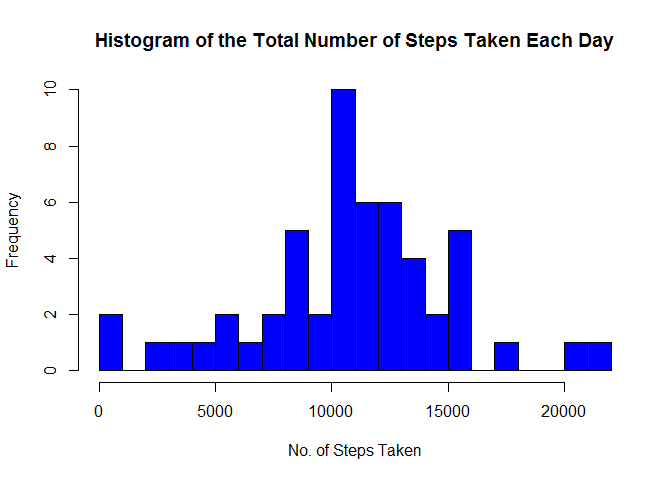
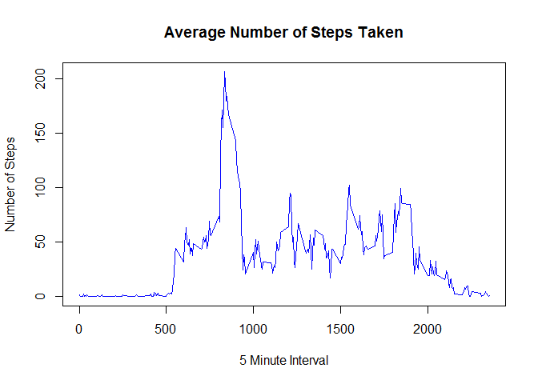
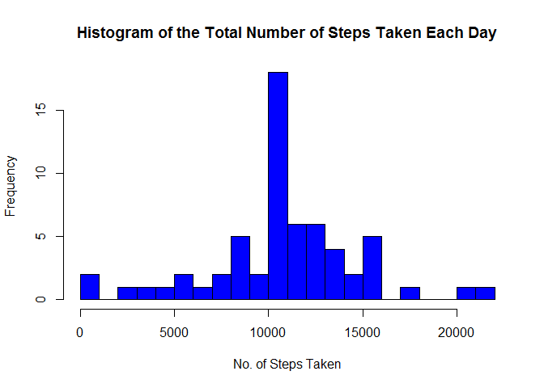
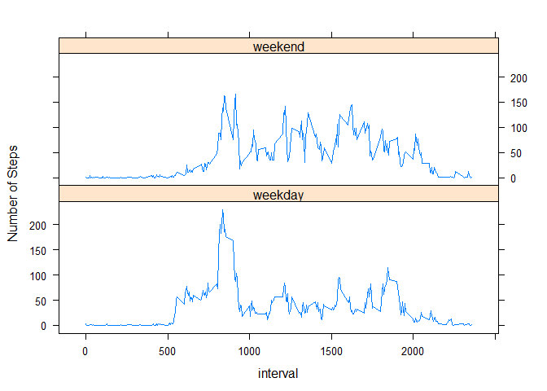

### Reproducible Research Peer-graded Assignment: Course Project 1 (week 2)

### Loading and preprocessing the data

1.Load the data (i.e. read.csv())

    mainsource <- read.csv("./activity.csv", sep = ",", header = TRUE, na.strings = "NA")

2.Process/transform the data (if necessary) into a format suitable for
your analysis

    mainsource$date<-as.Date(mainsource$date,"%Y-%m-%d")

### What is mean total number of steps taken per day?

1.Calculate the total number of steps taken per day

    totalnosteps <-aggregate(mainsource$steps, list(mainsource$date), sum, na.rm = TRUE)
    head(totalnosteps,10)

2.Make a histogram of the total number of steps taken each day

    hist(as.numeric(totalnosteps$steps),
                      breaks = 10,
                      col = "blue",
                      xlab = "No. of Steps Taken",
                      main="Histogram of the Total Number of Steps Taken Each Day")

3.Calculate and report the mean and median of the total number of steps
taken per day

    Meantotalnosteps <- mean(totalnosteps$steps, na.rm = TRUE)

    mean(totalnosteps$steps, na.rm = TRUE)

    ## [1] 10766.19

    Mediantotalnosteps <- median(totalnosteps$steps, na.rm = TRUE)

    median(totalnosteps$steps, na.rm = TRUE)

    ## [1] 10765

### What is the average daily activity pattern?

1.Make a time series plot (i.e. type = "l") of the 5-minute interval
(x-axis) and the average number of steps taken, averaged across all days
(y-axis)

    stepsinterval <- aggregate(steps ~ interval, data = mainsource, mean)
    plot(stepsinterval$interval, stepsinterval$steps, 
                      col = "blue", 
                      type = "l", 
                      xlab = "5 Minute Interval", 
                      ylab = "Number of Steps",
                      main = "Average Number of Steps Taken")

2.Which 5-minute interval, on average across all the days in the
dataset, contains the maximum number of steps?

    stepsinterval[which.max(stepsinterval$steps), ]

    ##     interval    steps
    ## 104      835 206.1698

It is observed that the maximum number of steps is 206 which occurs at
interval 835.

### Imputing missing values

1.Calculate and report the total number of missing values in the dataset
(i.e. the total number of rows with NAs)

    sum(is.na(mainsource$steps))

    ## [1] 2304

    sum(is.na(mainsource$date))

    ## [1] 0

    sum(is.na(mainsource$interval))

    ## [1] 0

Total number of missing values in the dataset is 2304.

2.Devise a strategy for filling in all of the missing values in the
dataset. The strategy does not need to be sophisticated. For example,
you could use the mean/median for that day, or the mean for that
5-minute interval, etc.

    missingvalue <- which(is.na(mainsource$steps))
    fillNA <- mainsource
    fillNA[missingvalue, ]$steps<-unlist(lapply(missingvalue, FUN=function(missingvalue){
                    stepsinterval[mainsource[missingvalue,]$interval==stepsinterval$interval,]$steps
                    }))

3.Creating a new dataset that is equal to the original dataset but with
the missing data filled in.

    str(fillNA)

    ## 'data.frame':    17568 obs. of  3 variables:
    ##  $ steps   : num  1.717 0.3396 0.1321 0.1509 0.0755 ...
    ##  $ date    : Date, format: "2012-10-01" "2012-10-01" ...
    ##  $ interval: int  0 5 10 15 20 25 30 35 40 45 ...

4.Make a histogram of the total number of steps taken each day and
Calculate and report the mean and median total number of steps taken per
day.

    totalnostepsfillNA <- aggregate(steps ~ date, data = fillNA, sum)
    hist(as.numeric(totalnostepsfillNA$steps),
                      breaks = 20,
                      col = "blue",
                      xlab = "No. of Steps Taken",
                      main="Histogram of the Total Number of Steps Taken Each Day")
                      

    mean(totalnostepsfillNA$steps, na.rm = TRUE)

    ## [1] 10766.19

    median(totalnostepsfillNA$steps, na.rm = TRUE)

    ## [1] 10766.19

Do these values differ from the estimates from the first part of the
assignment? Yes, the values differ from the first part because for this
part, the mean and median are both equal at 10766.19

What is the impact of imputing missing data on the estimates of the
total daily number of steps? The impact of imputting missing data
changes the median.

### Are there differences in activity patterns between weekdays and weekends?

1.Create a new factor variable in the dataset with two levels -
"weekday" and "weekend" indicating whether a given date is a weekday or
weekend day.

    fillNA$day<-as.factor(weekdays(fillNA$date))
    fillNA$indicator<-ifelse(fillNA$day %in% c("Saturday","Sunday"), "weekend", "weekday")
    head(fillNA)

2.Make a panel plot containing a time series plot (i.e. type = "l") of
the 5-minute interval (x-axis) and the average number of steps taken,
averaged across all weekday days or weekend fdays (y-axis). See the
README file in the GitHub repository to see an example of what this plot
should look like using simulated data.

    #the average number of steps taken for weekdays 
    weekdaysfillNA <- fillNA[fillNA$indicator == weekday",]
    stepsperweekday <- aggregate(weekdaysfillNA$steps, list(weekdaysfillNA$interval), FUN=mean)
    stepsperweekday$indicator <- "weekday"

    #the average number of steps taken for weekends
    weekendfillNA <- fillNA[fillNA$indicator == "weekend",]
    stepsperweekend <- aggregate(weekendfillNA$steps, list(weekendfillNA$interval), FUN=mean)
    stepsperweekend$indicator <- "weekend"

    newfillNA <- rbind(stepsperweekday,stepsperweekend)
    newfillNA$indicator <- as.factor(newfillNA$indicator)
    colnames(newfillNA) <- c("interval","steps","indicator")
    library(lattice)
    xyplot(steps ~ interval  | indicator, data = newfillNA, layout = c(1,2), type ="l", ylab="Number of Steps")

Yes, there are differences in activity patterns between weekdays and
weekends. As observed, weekend at most times exceeded the 100 steps mark
but never reached the 200 steps mark. Weekday was able to reach the 200
steps mark at some point, but it remains below the 100 steps mark
throughout the duration of the interval.
